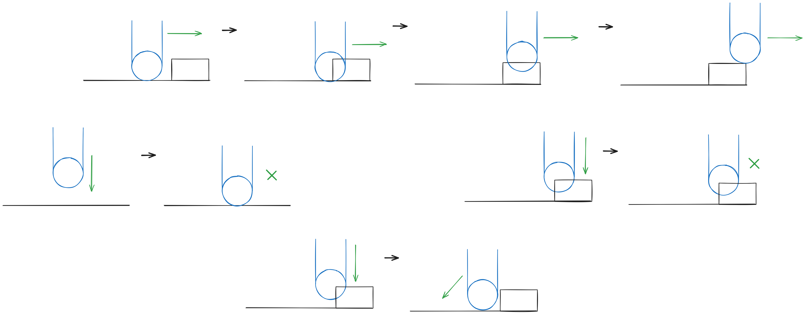

# Hybrid overlap grounding

A new approach to handle grounding for rigidbody characters in physically dynamic game worlds

---
## !!DISCLAIMER!!

Documentation is still WIP and code samples are very overcomplicated.

while all the research, design and implementation are done, the publishing of it all (AKA this repo) still needs a lot of work. I just haven't found the time yet

---
## What is this?

This repository contains working sample code that shows the proof of concept of a new grounding method for rigidbody characters. 
'Grounding' here refers to the systems that handle gravity, sticking a character to the ground, slopes, steps and other such systems.

A project I was working on for my study had a very dynamic scene; Lot's of rigidbodies that the player and other characters could interact with. The 'default'
methods of handling grounding weren't working out. I decided that I would attempt to create a different system for the grounding. *Many* hours later and I have this proof of concept.

The proof of concept is made for the Unity (6) game engine, but the concepts should translate fairly easily to other engines *as long as they have an API for manipulating collisions before they are resolved*.

## How to use it

Let me first explain what this *isn't*: A package you're supposed to blindly add to your projects.

While it would probably work, the idea behind this repo is that a developer adapts the code in this repo to fit their needs.

You can still try it out in Unity to see it in action though. Just clone this repository in your `Assets` folder like so:

`git clone https://github.com/RogueBit2002/hybrid-overlap-grounding`

## The design

In this design a character can overlap with the environment. An "up" vector is specified: the special axis. When a character
collides with something the collision gets modified to allow the two colliders to overlap based on the both the special axis
and the relative velocity. When overlapping, a force is applied on the character along the special axis to lift them up and
out of the environment. A character can move up and out of a collider, but never deeper inside. 

This design results in a system where characters can smoothly move over obstacles or up steps, but can never be pushed down
into the ground. 

## Future

The sample code was taken straight from the game with only the namespaces being changed. It has a few logic bugs and is very 
overcomplicated. My current goal is to clean everything up to create a simple, readable and portable design/spec and sample.
